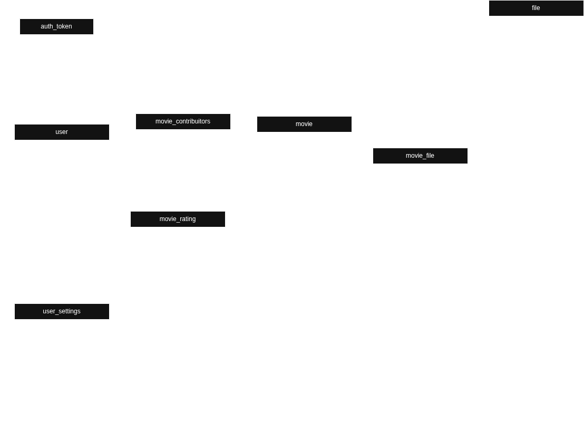
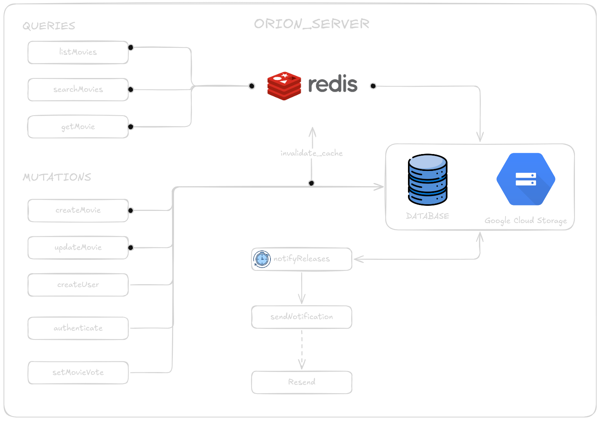

# Orion

> Gerenciador de filmes — Desafio técnico Cubos

[Serviço em Produção](https://orion-cubos-movies.web.app/login)


---

## Sumário

- [Visão Geral](#visão-geral)
- [Pré-requisitos](#pré-requisitos)
- [Como executar](#como-executar)
- [Client](#client)
- [Server](#server)
  - [Testes unitários](#testes-unitários)
  - [Migrations](#migrations)
  - [Infraestrutura](#infraestrutura)
  - [Fluxos de autenticação](#fluxos-de-autenticação)
- [Deploy via GitHub Actions](#deploy-via-github-actions)
- [Banco de dados](#banco-de-dados)
- [Arquitetura](#arquitetura)

---

## Visão Geral

O Orion é um gerenciador de filmes construído com dois workspaces: `client` e `server`. O client é uma aplicação React em TypeScript; o server é uma API REST em Node.js com Express, hospedada no Google Cloud Run.

---

## Pré-requisitos

Antes de iniciar, instale as seguintes ferramentas:

- [Google Cloud CLI](https://cloud.google.com/sdk/docs/install-sdk) — utilizado para listar os secrets da aplicação. O comando `start` já executa esse passo automaticamente.
- [Redis](https://redis.io/docs/latest/operate/oss_and_stack/install/archive/install-redis/) — utilizado como cache tanto em desenvolvimento quanto em produção.

---

## Como executar

Instale as dependências na raiz do projeto e utilize os comandos abaixo:

```bash
# Instalar dependências
npm install

# Iniciar o client
npm run start:client

# Iniciar o server
npm run start:server
```

---

## Client

O client roda na porta `3000` e é responsável pela interface entregue ao usuário. Ele utiliza um serviço dedicado para abstrair variáveis de ambiente, que são armazenadas via secrets.

### Storybook

O projeto usa o Storybook para visualização e teste isolado de componentes. Para executá-lo:

```bash
cd client
npm run storybook
# Acesse http://localhost:6006
```

### Internacionalização

As traduções são gerenciadas com `i18n`. O idioma principal é português (PT-BR), mas as chaves em inglês já foram criadas para facilitar a expansão futura.

### Temas

O usuário pode alternar entre os temas `dark` e `light`. A preferência é persistida no banco de dados. O padrão da aplicação é `dark`.

---

## Server

O server é escrito em TypeScript e utiliza Node.js como runtime e Express como framework HTTP.

### Filas com PubSub

Para simular o processamento de filas localmente, utilize o emulador do PubSub:

```bash
gcloud beta emulators pubsub start --project=<project-id>
```

### Testes unitários

Os testes utilizam Jest. Para executá-los:

```bash
npm run unit-test
```

### Migrations

As migrations são gerenciadas com o Knex. Comandos disponíveis:

```bash
# Criar todas as tabelas
npm run migrate:latest

# Reverter a última migration
npm run migrate:rollback

# Criar uma nova migration
npm run migrate:make <migration_name>
```

### Infraestrutura

| Serviço                | Uso                                  |
| ---------------------- | ------------------------------------ |
| Firebase Hosting       | Servir o client estaticamente        |
| Google Cloud Run       | Hospedar o server                    |
| Google Cloud Storage   | Armazenar imagens                    |
| Redis                  | Cache em dev e produção              |
| Resend                 | Envio de e-mails                     |
| Google Cloud PubSub    | Processamento de filas               |
| Google Cloud Scheduler | CronJob executado duas vezes por dia |

O CronJob notifica os contribuidores de um filme sobre o lançamento dos seus respectivos filmes.

### Fluxos de autenticação

Ao criar um usuário, um registro é gerado automaticamente na tabela `auth_token`. As requisições ao servidor devem incluir o token no header:

```
Authorization: Bearer <token>
```

O middleware de autenticação injeta o usuário no contexto de cada requisição, permitindo validações ao longo da aplicação.

**Hierarquia de permissões:**

| Papel    | Pode votar | Pode adicionar filmes | Pode editar/modificar filmes |
| -------- | ---------- | --------------------- | ---------------------------- |
| `viewer` | Sim        | Não                   | Não                          |
| `editor` | Sim        | Sim                   | Sim                          |
| `admin`  | Sim        | Sim                   | Sim                          |

Todos os usuários são criados como `viewer` por padrão.

---

## Deploy via GitHub Actions

Os workflows estão organizados em:

- `.github/workflows/server-ci-cd.yml` — CI/CD do server e deploy no Cloud Run.
- `.github/workflows/client-ci.yml` — Lint e testes do client.

O workflow do server é acionado em `push` e `pull_request` para `master`. O deploy em si é manual via `workflow_dispatch` no GitHub Actions.

**Campos configuráveis no deploy:**

`project_id`, `service_name`, `region`, `image_registry`, `build_context`, `node_env`, `secret_name`, `secret_path`

**Secrets obrigatórios no repositório:**

- `GCP_WORKLOAD_IDENTITY_PROVIDER`
- `GCP_SERVICE_ACCOUNT_EMAIL`

Após o deploy do server, o workflow executa o Terraform em `infra/terraform/gcp` para provisionar os tópicos do Pub/Sub e os Cloud Scheduler jobs.

---

## Banco de dados



---

## Arquitetura


